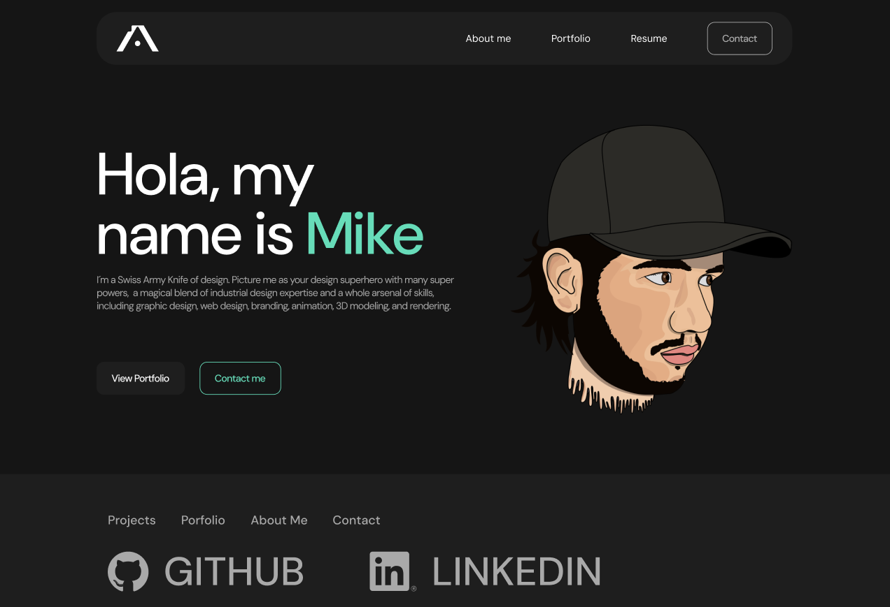

# Portfolio-Mike


A **React-based portfolio website** showcasing UX/UI Design, Front-End, and Full-Stack projects.

## Features
- **React, Vite & TypeScript**
- **Tailwind CSS** for styling
- **Dynamic project showcase**
- **Fully responsive**
- **Deployed on Netlify**

## Screenshots


## Installation
```bash
git clone https://github.com/mikealiaga/Portfolio-Mike.git
cd Portfolio-Mike
npm install
npm run dev
```

## Deployment
This project is deployed on Netlify.

Live Demo: [https://mikealiaga.netlify.app/](https://mikealiaga.netlify.app/)

## Contact
👤 **Your Name**  
GitHub: [mikealiaga](https://github.com/mikealiaga)  